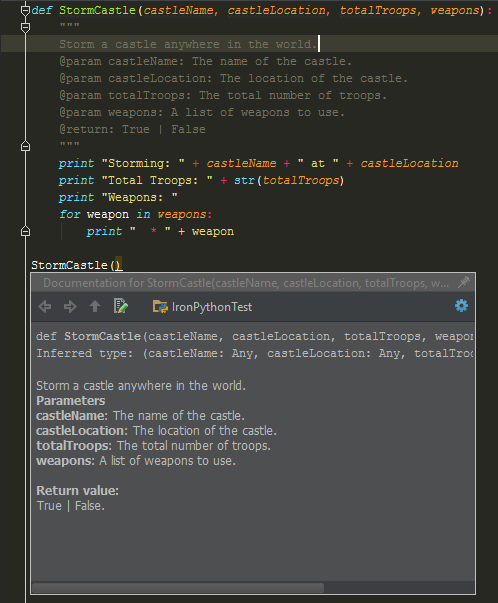

# Function Basics
A function is a named chunk of code that performs some specific task. Functions are used to typically run the same piece
of code without having to rewrite the same bits over and over again. Functions can take in some input and return output
but neither are specifically required. Functions are generally used to help write neat and optimal code and comprise one 
of the big building blocks that make up programming. The syntax for specifying a block of code to be a function is to use
the `def` keyword followed by the name of the function and a colon, the block of code should be indented one level after.
The naming standard to follow with functions is that they should be lower case using underscores as necessary. 

Example:
```python
def hello_world():
    print('Hello World!')

def hello(name):
    print('Hello ' + name)              

hello_world()                       # Prints 'Hello World!'
hello("Ron")                        # Prints 'Hello Ron'
hello("Sally")                      # Prints 'Hello Sally'
```

## Docstring
Docstrings are a way to document code. It is simple a multiline string that describes the intended goal of a function
so that someone who has not written the code can easily/quickly understand what the code is doing and how they could
go about using it. We use triple quotes to signify a multiline string. The docstring is the first line(s) following the
declaration of the function. Some IDEs have the benefit of showing the user a docstring when you hover over a function.

Example:
```python
def hello(name):
    """This function prints out "Hello" followed the name specified as the parameter
    :param name: A string which represents the name printed after "Hello"""
    print ("Hello", name)
```

In the example below, when calling the StormCastle function, PyCharm shows the docstring displaying what the parameters
are and their descriptions. There are more settings that you can set within the IDE in terms of what format to follow
for doc strings. Typically, it is good behavior to describe what the function does (if it's non-obvious), what parameters
it requires, and what it returns (covered below!)


## Parameters
Parameters are the variables that are accepted by functions in the parenthesis of the declaration. Some functions may
take zero parameters, some may take many! In general, you should avoid requiring too many variables in the function
declaration as it can get crowded and be visually hard to follow. We will cover using args/kwargs as a method of getting
by this!

### Optional
One neat thing we can do with parameters is make them optional so that the user does not need to specify them unless they
know that they need a non default value. 

Example:
```python
def print_name_multiple(name, times=1):
    print(name*times)

print_name_multiple('ron')                      # Prints 'ron'         
print_name_multiple('ron', 5)                   # Prints 'ronronronronron'
```

The only requirement when using optional parameters is that the MUST be the last parameters in the function declaration.
Otherwise, there is no way for the Python interpreter to know what parameters are being passed into the function. 

### args
`*args` is an easy way to specify that a function can take many more parameters without specifying their names. Specifying
the asterisk before args unpacks the values of all the parameters into a tuple called args. This allows us to pass in 
many parameters when calling the function without specifying them all in the function declaration. Let's take a look at
how we can create a sum function with this.

We don't want to follow this method below because if we ever want to add another parameter to add, we need to specify it
```python
def sum_two(a, b):
    print (a + b)

sum_two(1, 2)           # prints 3


def sum_three(a, b, c):
    print (a + b + c)

sum_three(1, 2, 3)      # prints 6
```

Instead, we can use args to pass in as many as we want
```python
def print_sum(*args):
    total = 0
    for arg in args:
        total += arg
    print(total)


print_sum(1, 2)
print_sum(1, 2, 5, 10)
print_sum(1, 2, 5, 10, 50, 100)


# another way to call the variables with a list or tuple
nums_to_sum = [1, 2, 5, 10, 50, 100]
print_sum(*nums_to_sum)
```


### kwargs
kwargs, also known as keyword arguments, is very similar to args except that it requires a key value pair for parameters
that being passed in. When passing in the parameter, you will need to pass in the parameter name and it's value. Similar
to how we can pass a list or a tuple for args, we can pass in a dictionary instead.

```python
def print_name_multiple(name, multiple):
    print(name * multiple)
    
print_name_multiple(name="ron", multiple=2)


# another way to call the variables with a dict
params = {"name": "ron", "multiple": 2}
print_name_multiple(**params)
```

Similar to args, we can also specify `**kwargs` in the function declaration

```python
def print_name_multiple(**kwargs):
    """ This function takes kwargs but to make it work, we need the following kwargs:
    name - a string which represents a name
    times - an int which determines how many times the name should be printed"""
    name = kwargs.get('name', 'sally') # if we don't pass in name, it will default to sally
    times = kwargs.get('times', 1) #if we don't pass in times, it will default to 1

print_name_multiple()                       # prints sally
print_name_multiple(name='ron')             # prints ron
print_name_multiple(times=5)                # prints sallysallysallysallysally
print_name_multiple(name='john', times=3)   # prints johnjohnjohn

# similar to before, we can call with a dict
params = {"name": "jimmy", "multiple": 2}
print_name_multiple(**params)               # prints jimmyjimmy
```


## Return
As mentioned previously, a function also have an output which we can use. This process is called a `return`. Returns are
generally used at the end of a function to return some output value but can also be used to exit out of a function early.
We can convert our previous sum examples to return the value instead of printing. This allows the user to use that value
for other needs. 

```python
def get_sum(*args):
    total = 0
    for arg in args:
        total += arg
    return total

total = get_sum(1, 2, 3, 4, 5)
print("The total is " + total)          # prints The total is 15
```


## \_\_main__
Within a python script that has multiple functions, we can run them by just calling them but the correct way is to use
the main function. Main is where we can determine the starting point of the code. This helps keep with organization and
readability. Refer to the example below to check out the syntax:

```python
def get_sum(*args):
    total = 0
    for arg in args:
        total += arg
    return total
    
if __name__ == '__main__':
    get_sum(1, 2, 3)
```


## Recursion
Recursion is the process in which a function calls itself. Recursion can be a programming powerful technique but similar
to while loops, you want to be careful and make sure the code will return at some point. The way to think about recursion
is to have a base case (which will return) and recursive cases which keep calling the function until the base case is
eventually returned. We can follow an example below to see how we can use recursion to solve the fibonacci sequence.

```python
def fibonacci(n):
    if n < 1:   # base case
        return n
    else:       # recursive case
        return n + fibonacci(n-1)
```

Given a high enough n, this may throw an error because it will have called recursively too many times. Typically, 
recursion is not always looked as the correct answer because calling the function over and over again takes up space
and takes time. For certain problems, recursion is the correct answer especially since it provides a simple and neat
way to write code. For example, in the case above, it's easy to tell because it works intuitively since we are constantly
adding numbers and their predecessors.

\
\
\
\
[Up Next: Lesson 4 - Packages, Input/Output, & Exceptions](../lesson04-packages-io-exceptions/README.md)
\
\
\
[Go Back: Lessons 3 - Functions](README.md)
