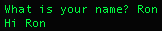
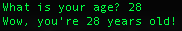

# Input
Python can also be used to take input of varying types, ranging from user input on the command line to reading entire
files. In this section, we'll go over some common examples but there is a LOT more in depth that you can go that will
not be covered. Please check out the [Python documentation](https://docs.python.org/3/tutorial/inputoutput.html) if 
you want even more detail. 


## User Input
One example of input that can be provided is when a user provides information to a program. This is done using the
input function. When the input function is used, the data that is passed back is read as a string so you will need
to convert it to a different type if you are not looking to work with a string.

String Example
```python
# This will print "What is your name? " and wait for the user to give an input
name = input("What is your name? ")
print(f"Hi {name}")     # Here we also introduce f-strings (available in Python 3.6+)
                        # You can define an f-string by putting an 'f' before the quotation marks
                        # Using f-strings allow you to efficiently put variables within strings
                        # This is neater than using "Hi " + name or "Hi {}".format(name)
```



Integer Example
```python
age = int(input("How old are you? "))   # Note we add a space after the question to the command line is neater
                                        # We also wrap everything inside int() to convert the answer to an integer
print(f"Wow, you're {age} years old!")
```



## Reading From Files
Similar to how we saw user input, Python has an inbuilt functions to create, read, modify files. In this section, we will
look at how we can read from existing files. When it comes to reading from files, usually we are trying to get some data
out of a file. For example, you have have a CSV that contains data. We can use Python to read in that data, parse it so
that we can use it programmatically, and do whatever we need to do with it. 

When reading files, we can specify the permission we are going to use when looking at the file to be `read only`. This
means that we will be able to read the file but not write anything to it. This level of control makes sure that we are
not risking modifying a file when we only want to read it. We can specify various types of modes when interacting with
a file. I've listed some common modes below:

|File Mode|Description|
|---------|-----------|
|r        |Read only mode, we will not be allowed to modify the file|
|w        |Write mode. If the file does not exist, this will create it|
|a        |Append mode, this allows us to write to the end of files. Again, the file is created if it doesn't exist|
|+        |This opens the file to be read/updated|

Let's take a look at some examples!


### Text
The most simple file we may try to read from is a text file, typically ending in `.txt`. This file generally only contains
characters and strings, and thus isn't very useful in terms of data that it can hold. But it may hold some string value
that we may want to pull up. Given that there is a file named `hello.txt`, we will try to read from it. We can use the
`filelines` method to get all the lines in the file into a list.

`hello.txt` (Sample Text File)
```text
This is a text file
I am the second line
There are three lines total
``` 

#### Parsing A Text File
Simple Way To Read From A File
```python
f = open('hello.txt', 'r')  # The r here represents that we are in read only mode
file_lines = f.readlines()  # This creates a list with each index being a line of the file
for line in file_lines:
    print(line)             # This will print out each line within the file

f.close()
```

This does a pretty good job but note that we have to always make sure we close the file. If this is not done, you could
open the file many times over and eventually run into an issue when you try to open it again.

A Slightly Better Way
```python
with open('hello.txt', 'r') as f:
    file_lines = f.readlines()
    for line in file_lines:
        print(line)
```

As you may have noticed, this block of code looks almost exactly the same. The use of the `with` to create a block makes
it so that the `f` is only accessible within the block. The file will be closed, without any extra code, after the block
has been run. 


### CSV
A CSV is a file format which stands for `Comma-Separated Values`. Each line in the file is text that is delimited by
commas. Typically, CSVs are a common way to store data, typically pulled from some spreadsheet or database. They are 
commonly used by Data Scientists/Analysts for Visualization. 

`data.csv` (Sample CSV File)
```text
id, name, country, job
1, Ron, USA, Software Engineer
2, Alice, Bolivia, CEO
3, Oscar, Canada, Sales Associate
```

#### Parsing A CSV File
```python
import csv # note we will need to import the csv library

with open('data.csv', 'r') as data_csv_file:
    csv_reader = csv.reader(data_csv_file, delimiter=',') # CSVs typically use ',' as a delimiter
    line_count = 0
    for row in csv_reader:
        if line_count == 0:
            print(f"The headers are {row}")                 # The headers are [id, name, country, job]
        else:
            print(f"{row[0]} is a {row[2]} from {row[1]}")  # sample: Ron is a Software Engineer from USA
```

As you can see, we use the `reader` function within the `csv` library to read the file and then go through row by row.
We note the first row as the headers and then proceed from there. The way it works is that each row is then used to
populate a list (in our case called row). We can use the indices within row to get the appropriate details. We can also
use our previously covered data structures to store this data if needed.

 
### JSON
JSON, JavaScript Object Notation, is an open-standard format that uses easily readable text to create data objects which
consist of key/value pairs. As you may suspect, this works VERY similar to how maps function. 

`people.json` (Sample JSON File)
```json
{
  "people": [
    {
      "name": "Ron",
      "occupation": "Software Engineer",
      "hobbies": [
        "programming",
        "eating",
        "badminton"
      ]
    },
    {
      "name": "Sally",
      "occupation": "Accountant",
      "hobbies": [
        "sleeping",
        "reading",
        "writing",
        "dancing"
      ]
    }
  ]
}
``` 

#### Parsing JSON
```python
import json                                     # we need to import the JSON library

with open('people.json', 'r') as json_file:
    json_data = json.dumps(json_file)
    print(json_data["people"][0])               # prints the Ron person object
    print(json_data["people"][1]["occupation"]) # prints "Accountant
```

As you can see, JSON is typically much easier to work with in comparison to the other formats that we saw. Due to its
key/value format, we can see elements are easy to access if you are aware of the structure.


## Input Arguments
In our previous examples, we see that we have hardcoded the filename within our script. This may be functional for us
given our setup but this may not be the same setup for someone else. To avoid hardcoding things that we cannot guarantee,
we can use arguments to specify files or any other information. The most popular library to do this is `argparse`.

### argparse
The argparse library allows us to accept arguments when running the file, this can be used in many different ways. One
common use is to specify a file as an argument so that the person executing the code is not necessarily forced to 
mimic the same setup as the developer just to get the code working. Let's take a look at an example of this:

In this case, we will assume that we are passing a file from our Downloads directory, assume that this is supposed to
be a json file (let's use the `people.json` from above).

#### Script Example (parse_example.py)
```python
# import the required libraries
import argparse
import json


def parse_arguments():
    """
    This function takes in the arguments provided when calling the function
    and returns them to be used in the rest of the code
    
    :param args: These arguments are what's passed in when calling the function

    :returns Returns the variables is an easily readable way
    """
    
    parser = argparse.ArgumentParser(description='Parsing arguments for script')
    # for each argument, you typically want to give a short hand way to call and a longer way
    # if possible, try to set a default and give a help string to show what that field represents
    parser.add_argument('-f', '--file', default='filename.ext', help='Indicates the path to the file')
    return parser.parse_args()


if __name__ == '__main__':
    args = parse_arguments()
    with open(args.file, 'r') as json_file:
        people = json.loads(json_file.read())
        
        # interact with people json object
        print(people[0]['name'])    # prints Ron (from example above)
```

#### Running The Script
```bash
python parse_example.py -f folder_name/second_folder/people.json
```

or 

```bash
python parse_example.py --file another_folder/people.json
```

You can have multiple arguments set up that may be required to run a script, use your best judgement to give the power
to  the script runner so that they won't need to specifically make changes to your code just to get it running. Always
try to think about how you can make the experience the simplest to follow to get something functional. At the same time,
don't go overboard! As is everything else, there is always a balance.

\
\
\
\
[Up Next: Lesson 4 - output](output.md)
\
\
\
[Go Back: Lessons 4 - Packages, Input/Output, & Exceptions](README.md)