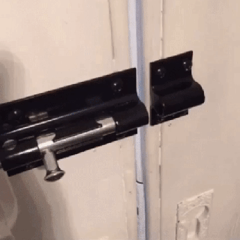

# Integration (Functional) Testing
Integration testing is, as the name suggests, testing the integration of various functions. If we have functions in various
python files that all come together to create one final product, the integration test will make sure the entire product
works holistically. Integration tests are extremely valuable to write but typically take more time in both creation and
runtime. You may wonder why we bother writing integration tests when we already have unit tests, look at the examples
below!

## Why We Should Test Integrations
When writing code, you may write the most perfect unit tests and they may ensure that every function within the program
works perfectly as expected. It may not be until they start working together that you realize something has gone wrong.
In the example below, both faucet and sink do their individual jobs. The faucet releases water and the sink 

 

\
\
\
\
[Up Next: Lesson 5 - Testing Example](testing-example/README.md)
\
\
\
[Go Back: Lessons 5 - Testing](README.md)